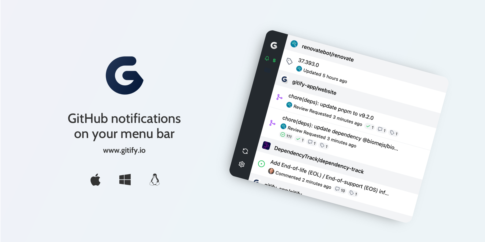

# Gitify [![Build Workflow][build-workflow-badge]][github-actions] [![Release Workflow][release-workflow-badge]][github-actions] [![Coveralls][coveralls-badge]][coveralls] [![Contributors][contributors-badge]][github] [![Downloads - Total][downloads-total-badge]][website] [![Downloads - Latest Release][downloads-latest-badge]][website] [![OSS License][license-badge]][license]

> GitHub Notifications on your menu bar. Available on macOS, Windows and Linux.



### Download

You can download Gitify for **free** from the website [www.gitify.io][website] or install it via [Homebrew Cask][brew].

```shell
brew install --cask gitify
```

Gitify supports macOS, Windows and Linux.

### Installation

    pnpm install

### Development

Optional: If you prefer to use your own OAuth credentials, you can do so by passing them as environment variables when bundling the app. This is optional as the app has some default "development" keys (use at your own discretion).

    OAUTH_CLIENT_ID="123" OAUTH_CLIENT_SECRET="456789" pnpm build

To watch for changes(`webpack`) in the `src` directory:

    pnpm watch

To run the **electron app**:

    pnpm start

### Releases

The release process is automated. Follow the steps below.

1. Verify that all features you want targeted in the release have been merged to `main`.
2. Create a [new **draft** release][new-release]. Set the tag version to something with the format of `v1.2.3`. Save as a **draft** before moving to the next step
3. Create a branch that starts with `release/vX.X.X` (ie. `release/v1.2.3`).
4. In the same branch, **bump the version** of the app by running `pnpm version <new-version-number`. Commit these changes and open a PR. A GitHub Actions workflow will build, sign and upload the release assets for each commit to that branch as long as a branch is named like `release/vX.X.X` and there is a draft release with the same version number(`package.json`).
5. Merge your release branch into `main`.
6. Publish the release once you've finalized the release notes and confirmed all assets are there.
7. Merge the open pull request in [gitify-app/website](https://github.com/gitify-app/website/pulls) (ie: `bump/v1.2.3`)

### Tests

There are 2 checks - one for prettier and one for the unit tests with `jest`.

```
    // Run prettier to check
    pnpm prettier:check

    // Run linter & unit tests with coverage
    pnpm test

    // If you want to pass arguments to jest (or other `pnpm` commands)
    // like `--watch`, you can prepend `--` to the command
    pnpm test -- --watch
```

### FAQ

Please visit our [Gitify FAQs][faqs] for all commonly asked questions.

### Contributing

1. Fork it!
2. Create your feature branch: `git checkout -b my-new-feature`
3. Commit your changes: `git commit -am 'Add some feature'`
4. Push to the branch: `git push origin my-new-feature`
5. Submit a pull request
6. Make sure tests are passing

### License

Gitify is licensed under the MIT Open Source license. For more information, see [LICENSE](LICENSE).

[website]: https://www.gitify.io
[faqs]: https://www.gitify.io/faqs
[github]: https://github.com/gitify-app/gitify
[github-website]: https://github.com/gitify-app/website
[new-release]: https://github.com/gitify-app/gitify/releases/new
[github-actions]: https://github.com/gitify-app/gitify/actions
[brew]: http://brew.sh/
[coveralls]: https://coveralls.io/github/gitify-app/gitify
[coveralls-badge]: https://coveralls.io/repos/github/gitify-app/gitify/badge.svg
[build-workflow-badge]: https://github.com/gitify-app/gitify/actions/workflows/build-app.yml/badge.svg
[release-workflow-badge]: https://github.com/gitify-app/gitify/actions/workflows/release.yml/badge.svg
[downloads-total-badge]: https://img.shields.io/github/downloads/gitify-app/gitify/total?label=downloads@all
[downloads-latest-badge]: https://img.shields.io/github/downloads/gitify-app/gitify/latest/total
[contributors-badge]: https://img.shields.io/github/contributors/gitify-app/gitify
[license]: LICENSE
[license-badge]: https://img.shields.io/github/license/gitify-app/gitify
